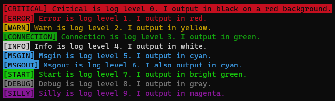

# Winchalk
An npm module that combines Winston and chalk for a yummy and colorful console logger.

Winchalk is just a Winston logger colorized with chalk. It is small and simple.

I made this module for myself, and though it's easy to customize your own Winston logger I thought I would let it out into the world since I use it all the time!

## Documentation

Winchalk exports a Winston logger. For Winston documentation, read here:
https://github.com/winstonjs/winston#readme

The log levels are as follows:
```
const Winchalk = require('winchalk');

Winchalk.critical("Critical is log level 0. I output in black on a red background.");
Winchalk.error("Error is log level 1. I output in red.");
Winchalk.warn("Warn is log level 2. I output in yellow.");
Winchalk.connection("Connection is log level 3. I output in green.");
Winchalk.info("Info is log level 4. I output in white.");
Winchalk.msgin("Msgin is log level 5. I output in cyan.");
Winchalk.msgout("Msgout is log level 6. I also output in cyan.");
Winchalk.start("Start is log level 7. I output in bright green.");
Winchalk.debug("Debug is log level 8. I output in gray.");
Winchalk.silly("Silly is log level 9. I output in magenta.");
```
This results in the following output to console:\


By default, Winchalk log level is set to 'silly', meaning it logs everything. For more information on log levels, see the [Winston documentation](https://github.com/winstonjs/winston#readme).

## Tests
You can see what the outputs look like in your own console by running the test.
`$ npm run test`
